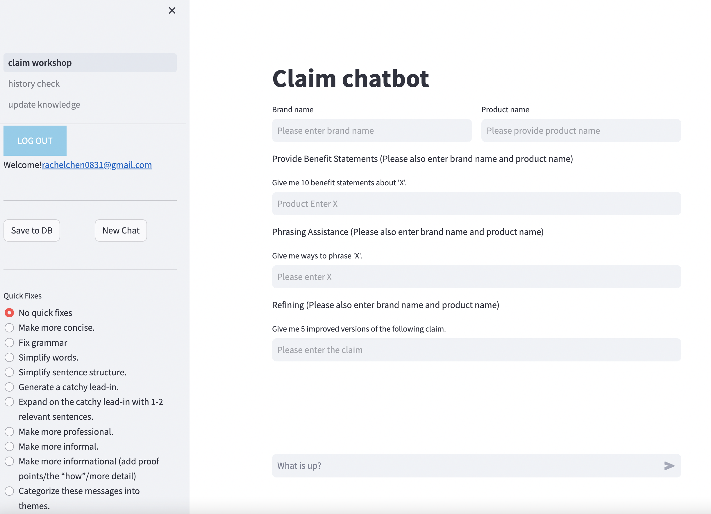

# Claim Assistant Chatbot App Introduction 

### Overview:
This Claim Assistant Chatbot App offers swift and optimal claim generation for companies. It utilizes the user's external knowledge, chat history, and tailors the content based on user privilege.

### Features:

**1. Claim Workshop:** The core component where the chat is conducted.
- Skimmers(company staff): Can view a comprehensive prompt, start a new chat, and save chat history to a database.
- Non-Skimmers: Only short prompts are displayed, start a new chat, and save chat history to a database.

**2. History Check:** A detailed chat history is displayed here. Users can delete the history, which is arranged from the newest to oldest.

**3. Upload Knowledge:** Allows skimmers(company staff) to upload files that the chatbot can leverage to extend its knowledge. The bot supports pdf, doc, and xlsx formats.

**4. Non-Skimmers:** They are limited in terms of visibility of long prompts and access to knowledge upload. 

### System Underlying:

The app is backed by technologies like LlamaIndex, LangChain, OpenAI, DynamoDB and Cognito for providing a seamless and efficient experience.

### Hosting Pricing:
AWS lightsail: container (medium server): $40/mo

### Link:
To explore the [chatbot](https://claim-workshop.fd5vdj4lk4akg.eu-west-1.cs.amazonlightsail.com/)

Click the video: 

